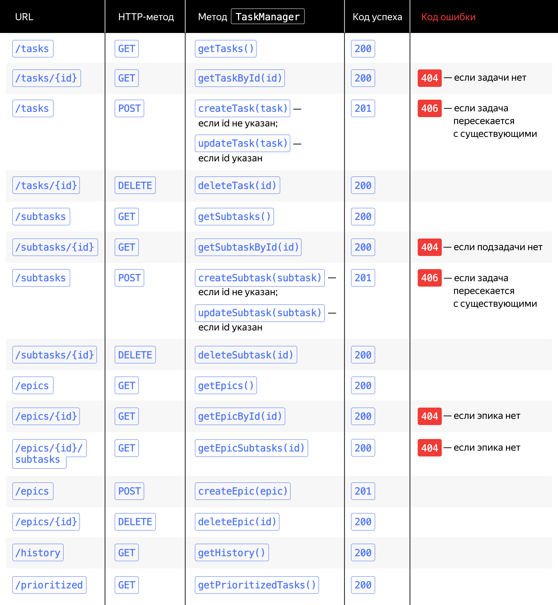

# Техническое задание проекта №9
## Трекер задач

### Прорабатываем логику API

Ваша задача — реализовать API, в котором эндпоинты будут соответствовать вызовам базовых методов интерфейса TaskManager. Например, вызову метода getTasks() будет соответствовать эндпоинт GET /tasks. Такое соответствие эндпоинтов и методов называют маппингом (от англ. mapping).

Все методы TaskManager можно разделить на пять групп. Это методы для работы с обычными задачами, подзадачами, эпиками, а также с историей и списком задач в порядке приоритета.

Каждой группе в API должен соответствовать свой путь — так интерфейс будет максимально удобным и понятным для пользователя. Следовательно, базовые пути приложения будут следующие: /tasks, /subtasks, /epics, /history и /prioritized.

Для выполнения разных операций с данными для одного и того же пути используют разные HTTP-методы. Так, для запросов на чтение данных (например, для получения списка задач) используют метод GET, для модификации данных (например, для добавления новой задачи или изменения существующей) — POST, а для удаления данных (например, для удаления задачи) — DELETE.

Не забудьте о статусах ответа, которые сервер будет возвращать пользователю. Начнём с кодов успеха:

* если сервер корректно выполнил запрос и вернул данные — код 200;
* если запрос выполнен успешно, но возвращать данные нет необходимости (так бывает в запросах на их модификацию) — код 201.

На случай проблем с запросами пользователя пригодятся коды ошибок — их будет три:

* если пользователь обратился к несуществующему ресурсу (например, попытался получить задачу, которой нет) — статус 404 (Not Found);
* если добавляемая задача пересекается с существующими — статус 406 (Not Acceptable);
* если произошла ошибка при обработке запроса (например, при сохранении данных менеджера в файл) — статус 500 (Internal Server Error).

Осталось определить формат, в котором данные будут передаваться между клиентом и сервером. Стандартным считается формат JSON — используйте его.

Подведём итог и опишем ожидаемый API в виде таблицы.

